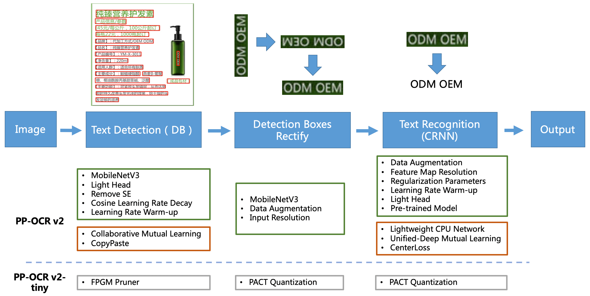
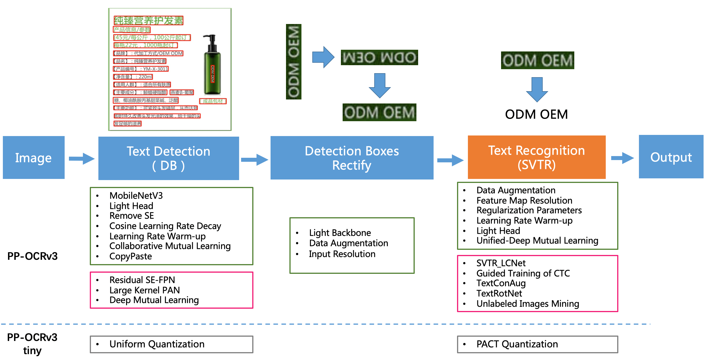

## Introduction for PP-OCRv3

PP-OCRv3 is further upgraded on the basis of PP-OCRv2. Included of **text-detection model** _(DBNet)_ and **text-regconition model** _(CRNN in v2 is replaced to SVTR in v3)_.

## PP-OCRv2 Framework

## PP-OCRv3 Framework

In the pink box of the image above, there are some strategies that newly introduced in PP-OCRv3.

> So there are 9 optimization strategies (_3 in **text-detection** and 6 in **text-recognition**_).

| Text detection | Description                                       |
| -------------- | ------------------------------------------------- |
| LK-PAN         | A PAN structure with large receptive field        |
| DML            | Deep Mutual Learning strategy for teacher model   |
| RSE-FPN        | A FPN structure with residual attention mechanism |

| Text regconition | Description                                                         |
| ---------------- | ------------------------------------------------------------------- |
| SVTR_LCNet       | A Light-weight text recognition network                             |
| GTC              | Guided training of CTC by Attention                                 |
| TextConAug       | A data augmentation strategy for mining textual context information |
| TextRotNet       | Self-supervised strategy for a better pretrained model              |
| UDML             | Unified deep mutual learning strategy                               |
| UIM              | Unlabeled data mining strategy                                      |
