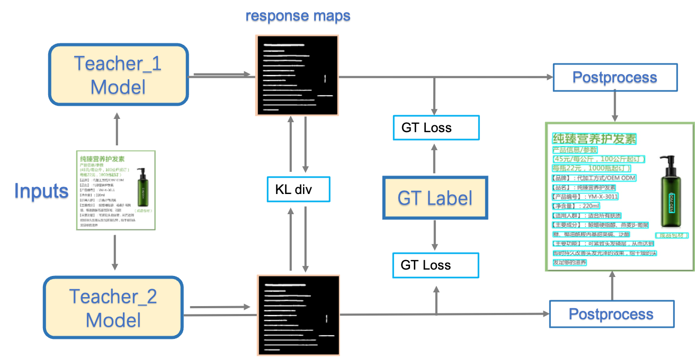

## DML: Deep Mutual Learning Strategy for Teacher Model

**DML** a.k.a **Deep Mutual Learning**

> Using to improve the accuracy of the text detection model by learning from each other with two models with the same structure.

##### Result:

> hmean is increased from 85% to 86%.

> Affecting to the student model by updating the teacher model of **CML** in **PP-OCRv2**. (hmean of the student model can be improved from 83.2% to 84.3%)
