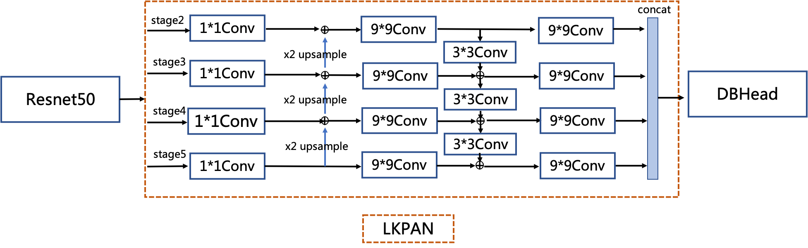

## LK-PAN: A PAN structure with large receptive field

**LK-PAN** a.k.a **Large Kernel PAN** is a lightweight PAN structure with larger receptive field.

The main idea is change the kernel size in the _path augmentation_ of the PAN structure from `3*3` to `9*9`.

##### But why increasing the kernel size ?

> For the receptive field of each position of the feature map is improved, making it easier to detect text in large fonts and text with extreme aspect ratios.

##### RESULT:

> The hmean of the teacher model can be improved from 83.2% to 85.0%.
