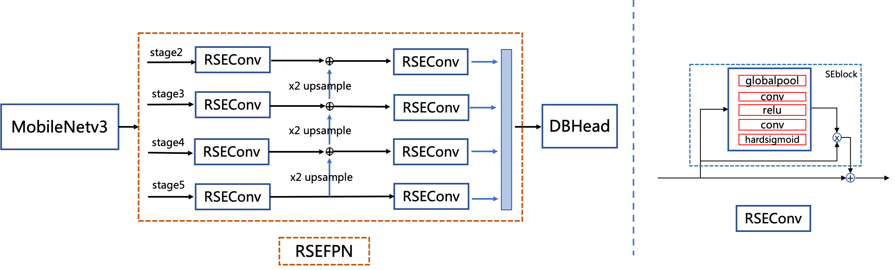

## RSE-FPN: A FPN structure with residual attention mechanism

**RSE-FPN** a.k.a **Residual Squeeze-and-Excited FPN**

Replacing the convolutional layer in the **FPN** with RSEConv to _improve the representation ability of the feature map_.

##### Result:

> hmean of the student model can be further improved from 84.3% to 85.4%.
