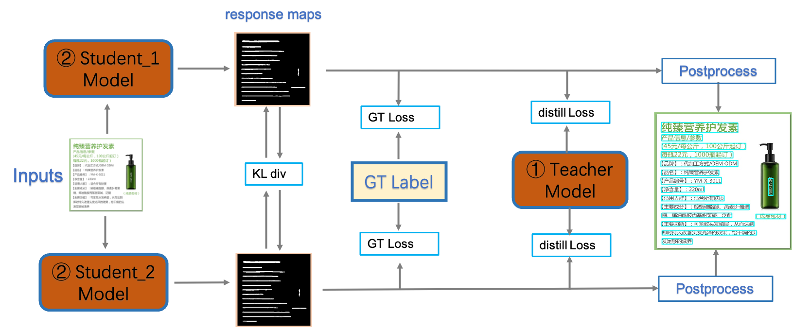

## Optimization for Text Detection Model

The **PP-OCRv3** detection model upgrades the CML _(Collaborative Mutual Learning)_ distillation strategy proposed in PP-OCRv2.

> CML is a model that utilizes two student networks and a teacher network to learn a more robust text detector.

The **PP-OCRv3** optimizes both _Teacher model_ and _Student model_.

##### For teacher model:

- LK-PAN.
- DML.

##### For student model:

- RSE-FPN.
