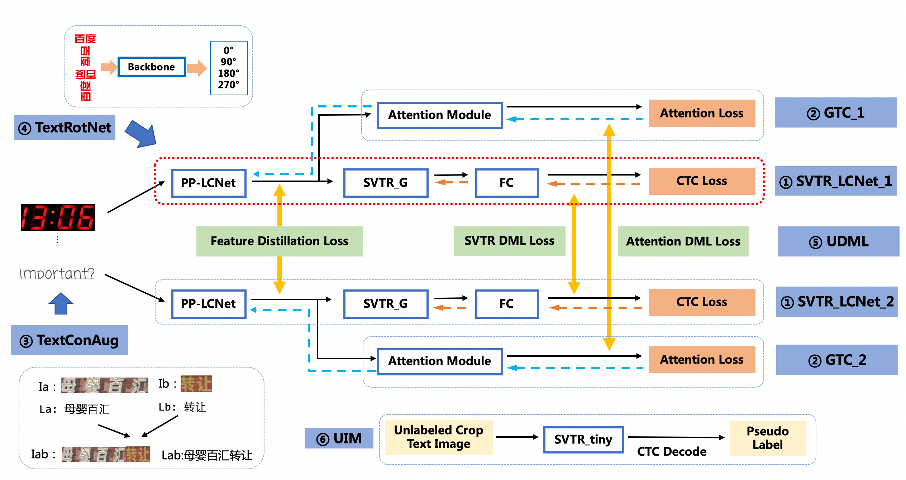

## Optimization for Text Recognition Model

The regconition module of **PP-OCRv3** is optimized based on the text regconition algorithm **SVTR**.

But there's a problem
Although the accuracy of **SVTR_tiny** outperforms **PP-OCRv2** by 5.3% **BUT**

> The prediction speed is nearly **11 times** slower !

> So, **PP-OCRv3** adopts 6 optimization strategies to accelerate the regconition model.

###### The ablation experiments are as follows:

| ID  | Strategy        | Model size | Accuracy | Prediction speed（CPU + MKLDNN) |
| --- | --------------- | ---------- | -------- | ------------------------------- |
| 01  | PP-OCRv2        | 8.0M       | 74.80%   | 8.54ms                          |
| 02  | SVTR_Tiny       | 21.0M      | 80.10%   | 97.00ms                         |
| 03  | SVTR_LCNet(h32) | 12.0M      | 71.90%   | 6.60ms                          |
| 04  | SVTR_LCNet(h48) | 12.0M      | 73.98%   | 7.60ms                          |
| 05  | + GTC           | 12.0M      | 75.80%   | 7.60ms                          |
| 06  | + TextConAug    | 12.0M      | 76.30%   | 7.60ms                          |
| 07  | + TextRotNet    | 12.0M      | 76.90%   | 7.60ms                          |
| 08  | + UDML          | 12.0M      | 78.40%   | 7.60ms                          |
| 09  | + UIM           | 12.0M      | 79.40%   | 7.60ms                          |
